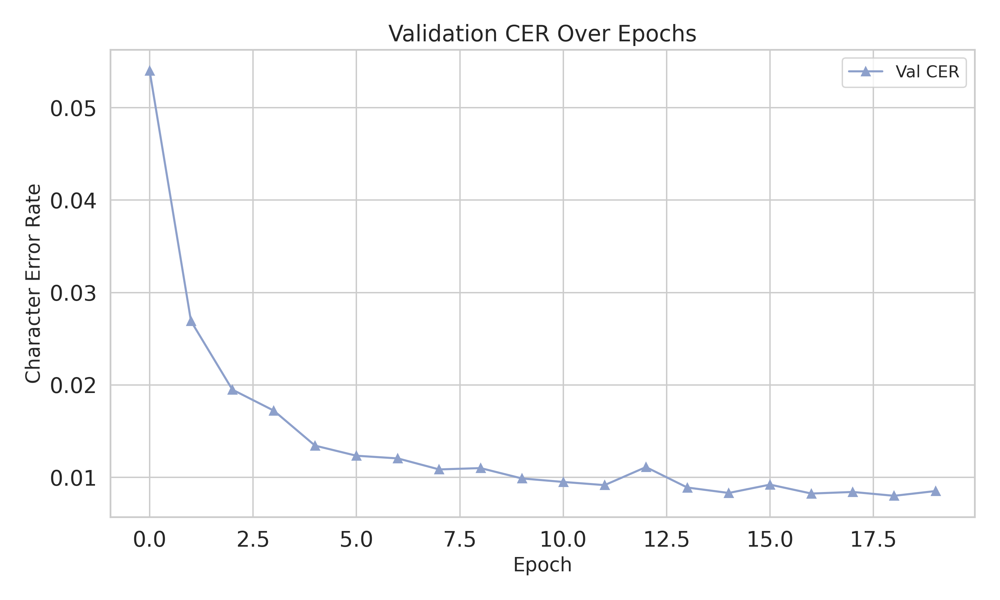

# NNXP

End-to-End Neural based Transliteration Pipeline

- The pipeline heavily adopts strategy from [kaldi](www.kaldi_asr.org) and [espnet](https://github.com/espnet/espnet) without too much over-abstraction.

Tools and Technology used

```bash
python: 3.10.16

# Deep Learning Framework
pytorch: 2.6

# GPU
Quadro RTX 5000 (16GB VRAM)
```

**More details will be added later.**

## Directory structure

```cmd
xlit_project/
│
├── conf/                           # Configuration files
│   ├── train.yaml                  # Default training config
│   └── tuning/                     # Model-specific tuning configs
│       ├── cnn.yaml                # CNN model config
│       ├── lstm.yaml               # LSTM model config
│       ├── transformer.yaml        # Transformer model config
│       └── ... (other configurations)
│
├── db/                             # Dataset folder
│   └── transcribed.txt             # ben-mni dataset
│
├── exp/                            # Experiment outputs
│   ├── xlit_train_attention_char_ben_mni/
│   │   ├── data/                   # Token and dataset files
│   │   │   ├── ben_char_tokens.txt # Bengali tokens (langx: Source Language)
│   │   │   ├── mni_char_tokens.txt # Meetei mayek tokens (langy: Target Language)
│   │   │   ├── train_ben_mni.txt   # Training dataset
│   │   │   └── val_ben_mni.text    # Validation dataset
│   │   ├── decode/
│   │   │   └── wa.best.decode      # Predictions on val dataset based on Best Word Accuracy Model
│   │   ├── images/
│   │   │   ├── cer.png             # Character Error Rate plot
│   │   │   ├── losses.png          # Training and validation losses plot
│   │   │   └── wa.png              # Word Accuracy Plot
│   │   ├── tensorboard/            # TensorBoard logs
│   │   ├── *epoch.pth              # Model checkpoint files
│   │   ├── train.loss.best.pth     # Best model by training loss
│   │   ├── train.log               # Training log
│   │   ├── val.loss.best.pth       # Best model by validation loss
│   │   ├── val.loss.ave.pth        # Averaged model across top-N val losses
│   │   └── wa.best.pth             # Best Word Accuracy model
│   └── ... (other experiments)
│
├── src/                            # Source code
│   ├── data/
│   │   ├── loader.py               # Dataset loader logic
│   │   └── utils.py                # Data utilities
│   ├── models/
│   │   ├── __init__.py
│   │   ├── attn.py                 # Attention model
│   │   ├── base.py                 # Base model class
│   │   ├── cnn.py                  # CNN-Attention model
│   │   ├── lstm.py                 # LSTM model
│   │   ├── positional_encoding.py  # Positional encoding utility
│   │   └── transformers.py         # Transformer model
│   ├── tokenizer/
│   │   ├── __init__.py
│   │   ├── base.py                 # Base tokenizer class
│   │   └── char_tokenizer.py       # Character-level tokenizer
│   ├── utils/
│   │   ├── __init__.py
│   │   ├── logger.py               # Logging utilities
│   │   ├── plot.py                 # Plotting metrics (loss, accuracy, etc.)
│   │   ├── save.py                 # Model saving utilities
│   │   └── seed.py                 # Random seed setup for reproducibility
│   └── xlit_task.py                # Core XlitTask class for training/inference
│
├── build.ipynb                     # Notebook to build configs and source structure
├── nb_infer.ipynb                  # Inference Notebook
├── nb_train.ipynb                  # Training Notebook [Attention]
├── nb_train_cnn.ipynb              # Training Notebook [CNN-GRU]
├── nb_train_lstm.ipynb             # Training Notebook [LSTM]
├── nb_train_transformer.ipynb      # Training Notebook [Transformer]
├── README.md                       # Project description and usage
└── requirements.txt                # Python dependencies
```

### Model Performance Summary

| Model       | Best CER (Epoch) | Best WA (Epoch) | # Parameters | Training Time | # Epochs | Avg. Time/Epoch |
| ----------- | ---------------- | --------------- | ------------ | ------------- | -------- | --------------- |
| Attention   | 0.0084 (34/49)   | 0.9501 (43)     | 653,231      | 04:37:18      | 50       | 00:05:33        |
| LSTM        | 0.0173 (47)      | 0.9129 (47)     | 542,639      | 02:49:25      | 50       | 00:03:23        |
| Transformer | 0.0080 (19)      | 0.9534 (19)     | 5,313,071    | 20:05:50      | 20       | 01:00:18        |
| CNN+PE+Attn | 0.0125 (50)      | 0.9265 (50)     | 333,999      | 04:11:06      | 50       | 00:05:01        |

The decode data are here

- [Attention Model Decoding](./exp/xlit_train_attention_char_ben_mni/decode/wa.best.decode)

- [LSTM Model Decoding](./exp/xlit_train_lstm_char_ben_mni/decode/wa.best.decode)

- [Transformer Model Decoding](./exp/xlit_train_transformer_char_ben_mni/decode/wa.best.decode)

- [CNN Attention Model Decoding](./exp/xlit_train_cnn_attn_char_ben_mni/decode/wa.best.decode)

## Plots

### Loss Plots

- Attention Model


- LSTM Model


- Transformer Model


- CNN Attention Model


### Character Error Rate Plots

- Attention Model


- LSTM Model


- Transformer Model



- CNN Attention Model


### Word Accuracy Plots

- Attention Model


- LSTM Model


- Transformer Model


- CNN Attention Model


## Current Models

1. LSTM + Bahdanau-style Attention (additive)

```cmd
AttnSeq2Seq(
  (encoder): Encoder(
    (embedding): Embedding(64, 128)
    (rnn): LSTM(128, 128, num_layers=2, batch_first=True, dropout=0.25)
    (dropout): Dropout(p=0.25, inplace=False)
  )
  (decoder): Decoder(
    (embedding): Embedding(47, 128)
    (rnn): LSTM(256, 128, num_layers=2, batch_first=True, dropout=0.25)
    (fc_out): Linear(in_features=256, out_features=47, bias=True)
    (dropout): Dropout(p=0.25, inplace=False)
    (attention): Attention(
      (attn): Linear(in_features=256, out_features=128, bias=True)
      (v): Linear(in_features=128, out_features=1, bias=False)
    )
  )
)
```

2. LSTM

```cmd
LSTMSeq2Seq(
  (embedding): Embedding(64, 128)
  (encoder): LSTM(128, 128, num_layers=2, batch_first=True, dropout=0.25)
  (decoder): LSTM(128, 128, num_layers=2, batch_first=True, dropout=0.25)
  (output_layer): Linear(in_features=128, out_features=47, bias=True)
  (dropout): Dropout(p=0.25, inplace=False)
)
```

3. CNN + Scaled dot product Attention

```cmd
CNNSeq2SeqAttn(
  (encoder): ConvEncoder(
    (embedding): Embedding(64, 128)
    (pe): PositionalEncoding()
    (conv): Conv1d(128, 256, kernel_size=(3,), stride=(1,), padding=(1,))
    (dropout): Dropout(p=0.25, inplace=False)
  )
  (decoder): ConvDecoder(
    (embedding): Embedding(47, 128)
    (pe): PositionalEncoding()
    (conv): Conv1d(128, 512, kernel_size=(3,), stride=(1,), padding=(1,))
    (attn): ConvAttention()
    (fc_out): Linear(in_features=512, out_features=47, bias=True)
    (dropout): Dropout(p=0.25, inplace=False)
  )
)
```

## FAQs

Q. How to replicate training?
A. Check out trainig notebooks.

- [Training Attention Model](./nb_train.ipynb)
- [Training LSTM Model](./nb_train_lstm.ipynb)
- [Training Transformer Model](./nb_train_transformer.ipynb)
- [Training Transformer Model](./nb_train_cnn.ipynb)

Q. How to train on new languages?
A. Add you parallel data in db and add the location `db_file: db/<db_filename>` in your config yaml file. The format of content is simple `<src_word>\t<target_word>`.

Q. How to add new models?
A. Add configuration in `conf/tuning` and inherit `XlitModel` from `src.models/base/py`.

Q. How to do inference on existing model?
A. Check out inference notebook: [Inference Notebook](./nb_infer.ipynb).

## See more

- [Meetei/Meitei Mayek Keyboard for Windows](https://github.com/hoomexsun/mm_keyboard).
- [Khutsem Tool](https://https://github.com/hoomexsun/khutsem).
- [End-to-End Neural based Transliteration Pipeline](https://github.com/hoomexsun/nnxp).
- [Rule based Manipuri Machine Transliteration](https://github.com/hoomexsun/xlit).
