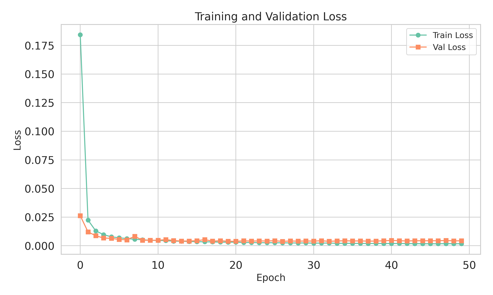
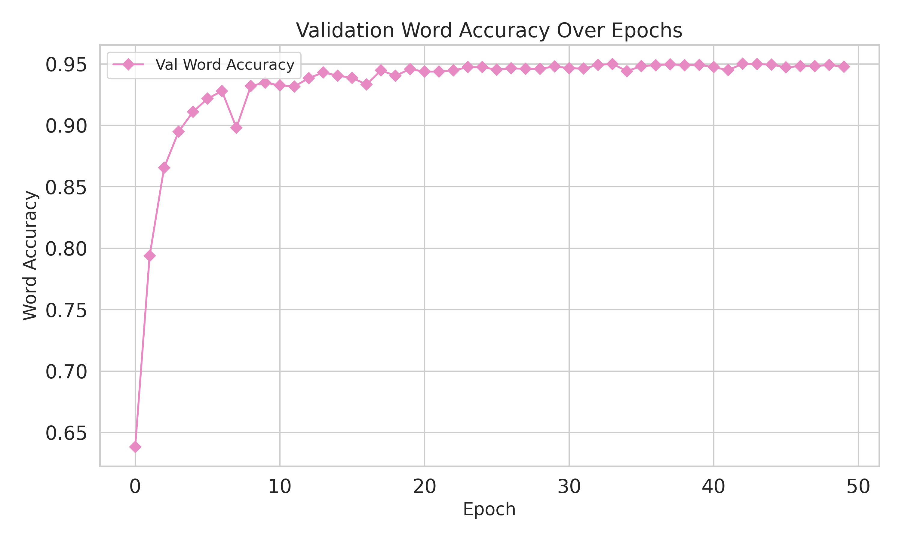

# NNXP

End-to-End Neural based Transliteration Pipeline

**More details will be added later.**

## Directory structure

```cmd
xlit_project/
│
├── conf/                           # Configuration files
│   ├── train.yaml                  # Default training config
│   └── tuning/                     # Model-specific tuning configs
│       ├── cnn.yaml                # CNN model config
│       ├── lstm.yaml               # LSTM model config
│       ├── transformer.yaml        # Transformer model config
│       └── ... (other configurations)
│
├── db/                             # Dataset folder
│   └── transcribed.txt             # ben-mni dataset
│
├── exp/                            # Experiment outputs
│   ├── xlit_train_attention_char_ben_mni/
│   │   ├── data/                   # Token and dataset files
│   │   │   ├── ben_char_tokens.txt # Bengali tokens (langx: Source Language)
│   │   │   ├── mni_char_tokens.txt # Meetei mayek tokens (langy: Target Language)
│   │   │   ├── train_ben_mni.txt   # Training dataset
│   │   │   └── val_ben_mni.text    # Validation dataset
│   │   ├── decode/
│   │   │   └── wa.best.decode      # Predictions on val dataset based on Best Word Accuracy Model
│   │   ├── images/
│   │   │   ├── cer.png             # Character Error Rate plot
│   │   │   ├── losses.png          # Training and validation losses plot
│   │   │   └── wa.png              # Word Accuracy Plot
│   │   ├── tensorboard/            # TensorBoard logs
│   │   ├── *epoch.pth              # Model checkpoint files
│   │   ├── train.loss.best.pth     # Best model by training loss
│   │   ├── train.log               # Training log
│   │   ├── val.loss.best.pth       # Best model by validation loss
│   │   ├── val.loss.ave.pth        # Averaged model across top-N val losses
│   │   └── wa.best.pth             # Best Word Accuracy model
│   └── ... (other experiments)
│
├── src/                            # Source code
│   ├── data/
│   │   ├── loader.py               # Dataset loader logic
│   │   └── utils.py                # Data utilities
│   ├── models/
│   │   ├── __init__.py
│   │   ├── attn.py                 # Attention model
│   │   ├── base.py                 # Base model class
│   │   ├── cnn.py                  # CNN-GRU model
│   │   ├── lstm.py                 # LSTM model
│   │   ├── positional_encoding.py  # Positional encoding utility
│   │   └── transformers.py         # Transformer model
│   ├── tokenizer/
│   │   ├── __init__.py
│   │   ├── base.py                 # Base tokenizer class
│   │   └── char_tokenizer.py       # Character-level tokenizer
│   ├── utils/
│   │   ├── __init__.py
│   │   ├── logger.py               # Logging utilities
│   │   ├── plot.py                 # Plotting metrics (loss, accuracy, etc.)
│   │   ├── save.py                 # Model saving utilities
│   │   └── seed.py                 # Random seed setup for reproducibility
│   └── xlit_task.py                # Core XlitTask class for training/inference
│
├── build.ipynb                     # Notebook to build configs and source structure
├── nb_infer.ipynb                  # Inference Notebook
├── nb_train.ipynb                  # Training Notebook [Attention]
├── nb_train_cnn.ipynb              # Training Notebook [CNN-GRU]
├── nb_train_lstm.ipynb             # Training Notebook [LSTM]
├── nb_train_transformer.ipynb      # Training Notebook [Transformer]
├── README.md                       # Project description and usage
└── requirements.txt                # Python dependencies
```

## Results

| Model     | Best CER             | Best WA           |
| --------- | -------------------- | ----------------- |
| Attention | 0.0084 (Epoch 34/49) | 0.9501 (Epoch 43) |
| LSTM      | 0.0173 (Epoch 47)    | 0.9129 (Epoch 47) |

The decode data are here

- [Attention Model Decoding](./exp/xlit_train_attention_char_ben_mni/decode/wa.best.decode)

- [LSTM Model Decoding](./exp/xlit_train_lstm_char_ben_mni/decode/wa.best.decode)

## Plots

### Loss Plots

Attention Model



LSTM Model


### Character Error Rate Plots

Attention Model


LSTM Model


### Word Accuracy Plots

Attention Model


LSTM Model

